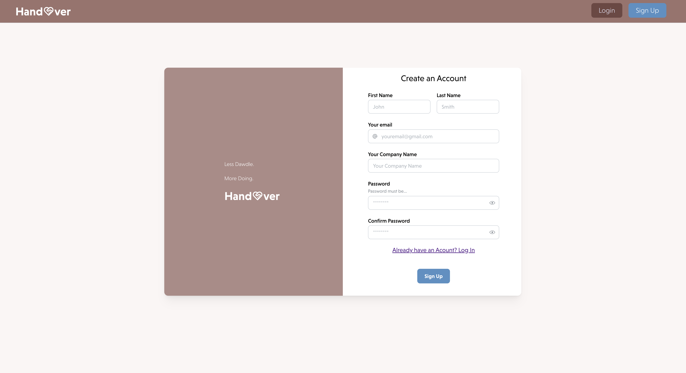
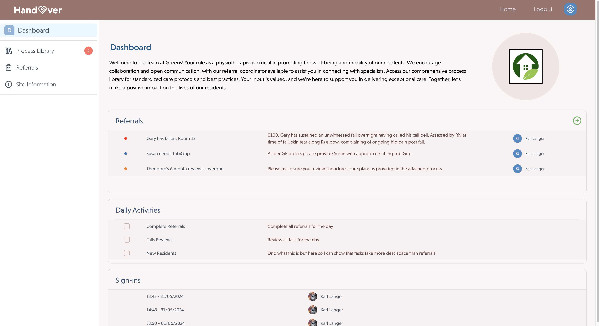
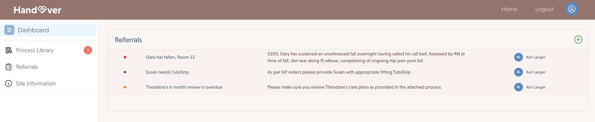
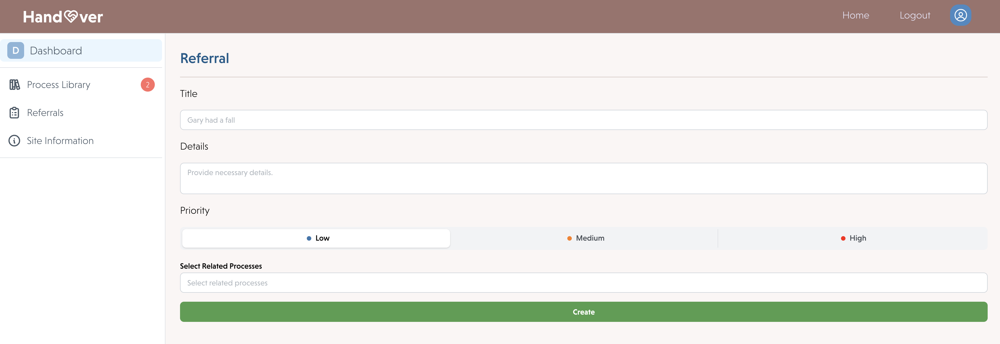
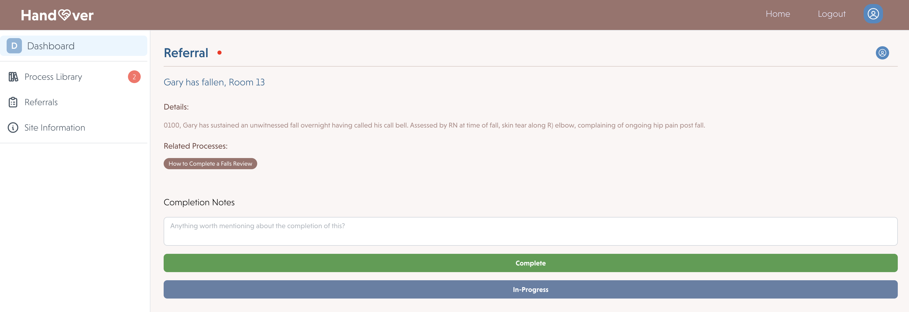
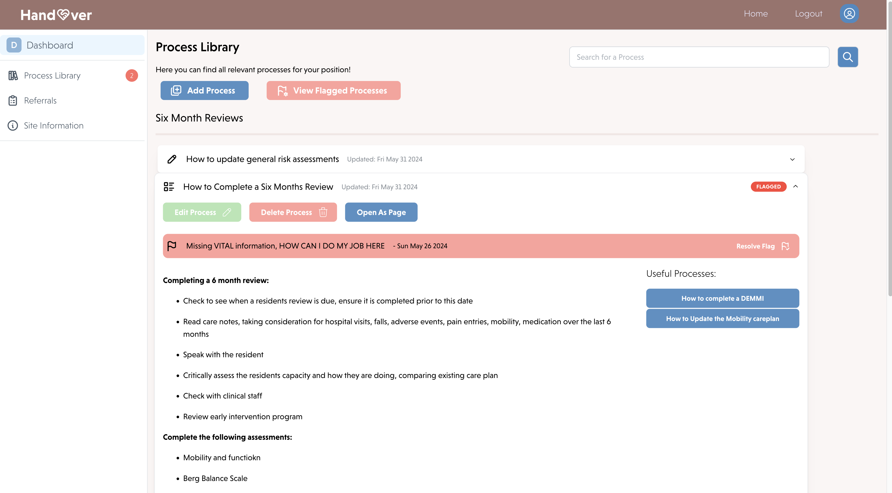
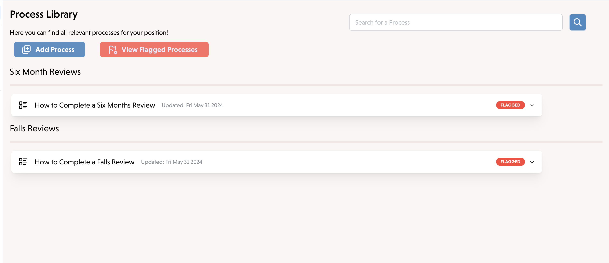

# Handover

## Description

Handover is a referral and process library management system designed to improve the onboarding process within certain medical fields. This application has been inspired by the often confusing and inconsistent nature of locum medical work where arriving at a locum site or new job is no gaurantee that the medical professional will receive a component handover. This application aims to reduce the friction associated with learning to navigate a new site, understand how to interact with a new sites system, receive personalised referrals and flag processes they have found confusing or believe require review. With this program admin will be able to create a library for their employees to access via a user account created by the admin. This application can be accessed in two modes as either a moderator or an employee. Employees will be able to complete referrals, access all information and flag processes while the moderator will have the capacity to create referrals, processes and resolve flagged processes. 

This project was completed as a part of the Adelaide University Web Development Bootcamp as a final project. It has been created using React as a Front End Framework, MongoDB for our database managemenet, node for our server-side environment, express for our server and GraphQL to assist with data querying and manipulation. We have also utilised JSON Web Tokens (JWTs) for a secure authentication experience with user login and log out. 

Live Link: https://handover-ac8i.onrender.com/

## Table of Contents (Optional)
- [Installation](#installation)
- [Usage](#usage)

## Installation
To install this application on your computer, simply clone this repository to your local environment. Once cloned follow these steps:
- Use 'npm i' to install all relevant packages 
- Use 'npm run develop' to launch a development environment 

## Usage
Live Link: https://handover-ac8i.onrender.com/

In order to create a referral and process library for your company you will first need to sign up. Signing up will specifically create a new Admin user who can subsequently add additional users in the 'Site Information' Tab. 

Once a new account has been created, navigate to the dashboard to see an introductory overview of what referrals and daily tasks are currently pending. 

Navigating to the referral page as a moderator you will be able to see a list of referrals. You will also be able to create a new referral by pressing the green "+" symbol. You will be prompted with a form to describe a referrals details and priority. You will also have the option to add "processes" to the referral. This will assist new employees or locums to understand how it is expected of them to complete a process.

Navigating to the Process Library will present the user with all the company's associated processes. Selecting a process accordion will drop down all the relevant information about that process. A single process may consist of multiple smaller processes, for that reason a list of related processes will appear in the right column for user navigation.

Users will find that they can flag an issue with a process if the process has become out of date, requires attention or does not make sense. This will be presented to the moderator for review.

Once a Process is flagged by a user, the moderator can filter out all flagged processes and update those processes as they deem necessary.

## Credits

Group Members:
- [Ben Taylor](https://github.com/zaczacariah?tab=repositories)
- [Karl Langer](https://github.com/KLanger98)